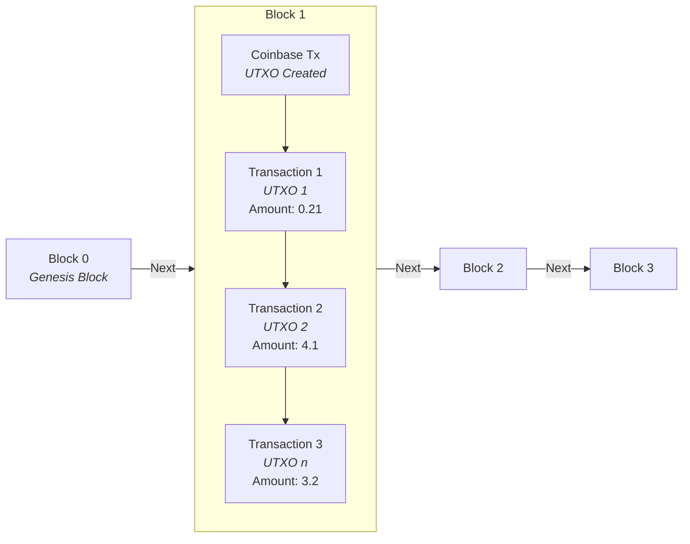
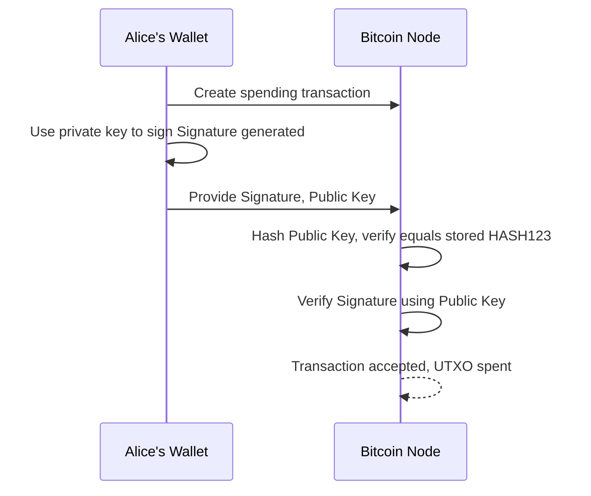
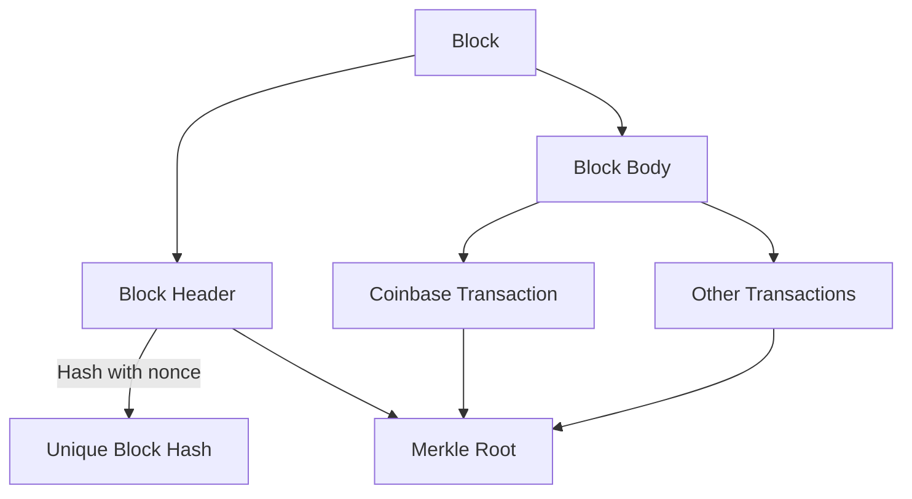

# Bitcoin 101

Bitcoin is a revolutionary digital currency and protocol that operates without central control. It uses cryptography, decentralized consensus, and a public ledger (the blockchain) to enable trustless transactions. This guide starts with an overall view of Bitcoin and then dives into the details of how the system works, including wallet internals, key management, transaction construction, and advanced features like multisignature and colored coins.

---

## High‑Level Overview

- **Decentralized Ledger:**  
  Bitcoin’s blockchain is a distributed ledger that records all transactions in blocks. Each block is cryptographically linked to the previous one, forming an immutable chain.

- **Cryptography & Trust:**  
  Bitcoin relies on public‑key cryptography. Each user controls funds via private keys, and funds are “locked” to addresses derived from public keys.

- **Proof‑of‑Work & Mining:**  
  Miners compete to solve a difficult computational puzzle (proof‑of‑work) to add a new block. In return, they earn new bitcoins (the block reward) plus transaction fees.

- **Finite Supply:**  
  Bitcoin has a fixed supply cap of 21 million coins, with new bitcoins issued gradually through block rewards that halve approximately every four years (every 210,000 blocks).

## The Blockchain and UTXO Model

### What Is the Blockchain?

- **Blocks and Links:**  
  Each block contains a set of transactions and a header with key data (previous block hash, Merkle root, timestamp, difficulty, nonce). The blocks are linked together by including the previous block’s hash in the header.

- **Proof‑of‑Work and Difficulty:**  
  Miners must produce a block header hash that is below a dynamic “difficulty target.” This target is adjusted to maintain an average block time of about 10 minutes.

### UTXOs (Unspent Transaction Outputs)

- **Fundamental Model:**  
  Bitcoin uses the UTXO model. Every transaction output that has not yet been spent is a UTXO—the “coins” you can spend later.
  
- **Tracking Balance:**  
  Wallets track UTXOs associated with your addresses to calculate your balance. Each UTXO is locked with a script that specifies spending conditions.

### Blockchain and UTXOs



*Each block contains transactions that spend UTXOs, and blocks are linked by their hashes.*


## Wallet Architecture and Key Management

Bitcoin wallets are software (or hardware) applications that allow users to store, manage, and spend their bitcoins. At their core, wallets perform two essential functions: **key management** and **transaction indexing**.

### Key Management

- **Public-Private Key Pairs:**  
  Every Bitcoin wallet is built around the concept of public-private key cryptography. Each key pair consists of a private key (a secret 256-bit number) and a corresponding public key. The public key (or, more commonly, its hash) is used to generate a Bitcoin address.  
  - **Private Key:** Must be kept secret. It is used to sign transactions, proving ownership of funds.  
  - **Public Key / Address:** Can be shared openly. Bitcoin addresses are derived from the public key using cryptographic hashing (SHA‑256 followed by RIPEMD‑160) and an encoding step (like Base58Check or Bech32).

### HD Wallets (Hierarchical Deterministic Wallets)  

> This section is specific for the [btcwallet](https://github.com/btcsuite/btcwallet) wallet

Public and private keys in `btcwallet` are generated using a hierarchical deterministic (HD) format as described in [BIP32](https://github.com/bitcoin/bips/blob/master/bip-0032.mediawiki). This method allows `btcwallet` to derive an unlimited number of key pairs from a single master seed, while keeping your private keys secure. For added security, unencrypted private keys are never written to disk.

`btcwallet` adheres to the [BIP44](https://github.com/bitcoin/bips/blob/master/bip-0044.mediawiki) standard for address derivation. It uses the following HD path for all derived addresses:

```
m/44'/<coin type>'/<account>'/<branch>/<address index>
```

#### Key Points:

- **BIP32 – Hierarchical Deterministic Keys:**  
  - All keys (both public and private) are derived deterministically from a single seed using the BIP32 standard.
  - This means that if you have your seed (usually represented as a mnemonic phrase per BIP39), you can recover your entire wallet.

- **BIP44 – Multi-Account Structure:**  
  - `btcwallet` uses the derivation path specified by BIP44:  
    `m/44'/<coin type>'/<account>'/<branch>/<address index>`
  - **Coin Type:** Determines the cryptocurrency (for Bitcoin mainnet, coin type is typically 0).
  - **Account:** Organizes funds into different accounts within the same wallet.
  - **Branch:** Typically, `0` is used for external (receiving) addresses, and `1` for internal (change) addresses.
  - **Address Index:** Each new address increments this index, providing a unique address for every transaction.

- **Security:**  
  - Private keys are encrypted and securely stored by btcwallet. Only the encrypted version is ever written to disk, ensuring your keys remain protected.
  - The deterministic nature of HD wallets means you only need to back up your seed phrase once; all derived keys can be regenerated from it.

### Transaction Indexing and UTXO Management

- **UTXO Model:**  
  Bitcoin uses an Unspent Transaction Output (UTXO) model. Every transaction output that has not been spent becomes a UTXO—an individual "coin" that your wallet tracks and can later spend.
  
- **Indexing and Balance Calculation:**  
  Wallets maintain an internal index of UTXOs associated with your addresses. When you query your balance, the wallet aggregates these UTXOs. Efficient indexing is key to quickly determining available funds and building new transactions.
  
- **Address Management:**  
  A wallet will generate multiple addresses to improve privacy and security.  
  - **External Addresses:** These are used to receive funds from others.
  - **Internal (Change) Addresses:** When spending funds, any “change” (leftover amount) is sent to a new internal address. This helps avoid address reuse and enhances privacy.
  
- **Metadata and Labels:**  
  Many wallets allow you to assign labels or account names to addresses. While these are user-friendly tags for organization, they are not part of the cryptographic keys and do not affect the underlying security or recovery process.

### Broad Architecture

- **User Interface & API Layer:**  
  The wallet provides a user interface (or APIs for developers) that abstracts the complex processes of key generation, transaction signing, and UTXO management.
  
- **Secure Storage:**  
  Wallets store private keys in an encrypted form on the device. For enhanced security, especially for large balances, many users employ cold storage solutions (offline hardware wallets or paper wallets).

- **Transaction Building & Signing:**  
  When you initiate a transaction:
  1. The **wallet selects** the appropriate UTXOs based on coin selection algorithms.
  2. It constructs a raw transaction specifying inputs (UTXOs) and outputs (destination addresses and change).
  3. The wallet then signs the transaction using the corresponding private keys.
  4. The signed transaction is broadcast to the Bitcoin network.

  **Note:**  
  It is also possible to manually select specific UTXOs for spending. However, this functionality is not built into the wallet’s high-level API. To achieve manual UTXO selection, you must build and sign a raw transaction using RPC calls such as `listunspent`, `createrawtransaction`, and `sendrawtransaction`—interacting directly with the blockchain rather than relying on the wallet's automatic coin selection.

### External vs. Internal (Change) Addresses

- **External Addresses:**  
  Addresses you share publicly to receive funds (e.g., m/44'/0'/0'/0/x).
  
- **Internal Addresses:**  
  Change addresses generated automatically to receive “change” when spending from UTXOs (e.g., m/44'/0'/0'/1/x).

## Transaction Construction, Signing, and Verification

### Spend-to-Hash (P2PKH)

- **Locking Script:**  
  When funds are sent to an address, the UTXO is locked by a script such as:  
  ```
  OP_DUP OP_HASH160 <pubKeyHash> OP_EQUALVERIFY OP_CHECKSIG
  ```
  This means the UTXO is bound to the hash of the recipient’s public key.

- **Unlocking Process:**  
  To spend the UTXO, the owner must supply:
  - Their public key (which, when hashed, must match the stored `pubKeyHash`).
  - A digital signature (generated using the private key) that proves ownership.

### Creating a Digital Signature

- **How It Works:**  
  Using ECDSA, the private key is used to sign the transaction data (or its hash). The resulting signature (a pair of numbers) is included in the unlocking script.
- **Verification:**  
  Nodes use the provided public key to hash it and compare it to the `pubKeyHash`, and then check the signature’s validity against the transaction data. This ensures only the owner (with the correct private key) can spend the funds.

### Simplified Transaction Example

- **Locking:**  
  Suppose Alice’s address is derived from her public key hash `HASH123`. When someone sends her 1 BTC, the output is locked with:
  ```
  OP_DUP OP_HASH160 HASH123 OP_EQUALVERIFY OP_CHECKSIG
  ```
- **Spending:**  
  To spend the 1 BTC, Alice creates a transaction input that provides:
  ```
  <Signature> <Public Key>
  ```
  The public key is hashed to verify it matches `HASH123` and the signature is verified. If both checks pass, the UTXO is spent.

### P2PKH Spending Process



## Advanced Transaction Types

Below is a Markdown snippet you can add to your README. It starts with an overview of colored coins and then provides a specific example using the `Omni Layer` API to issue a fixed-supply token.

### Colored Coins Overview

Colored coins are an overlay protocol built on top of Bitcoin that enable you to "color" standard UTXOs with additional metadata. This metadata can represent assets other than bitcoin—such as stocks, bonds, loyalty points, or digital collectibles—allowing these assets to be tracked and transferred on the Bitcoin blockchain. 

Key points about colored coins:

- **Overlay Concept:**  
  Colored coins do not change the underlying Bitcoin protocol. They use Bitcoin's scripting language (often by embedding data with `OP_RETURN`) to tag UTXOs with extra meaning.
  
- **Asset Representation:**  
  By associating metadata with a UTXO, the colored coin protocol designates that UTXO as representing a particular asset. For example, one token might represent one share of stock or one unit of a digital collectible.
  
- **Interpreting Metadata:**  
  Special software (such as `Omni Layer`, `Counterparty`, or `Open Assets`) reads the additional metadata to manage and track these tokenized assets. To the Bitcoin network, these transactions are standard, but the overlay protocol adds a layer of asset management.

- **Practical Use:**  
  Protocols like [Omni Layer](https://www.omnilayer.org/), built on Bitcoin, have been used to issue tokens such as Tether (USDT). While similar to colored coins, `Omni Layer` is a distinct overlay that extends Bitcoin’s capabilities beyond traditional colored coin implementations.

### Pay-to-Script-Hash (P2SH)

- **What It Is:**  
  Instead of locking funds directly to a public key hash, P2SH locks funds to the hash of a redeem script. This enables complex spending conditions such as multisignature.
  
- **Locking Script for P2SH:**  
  ```
  OP_HASH160 <scriptHash> OP_EQUAL
  ```
  When spending, the redeem script (and required signatures or data) is provided so that its hash matches `<scriptHash>`.

### Multisignature (Multisig)

- **Definition:**  
  Multisig transactions require multiple signatures to spend funds. For example, a 2-of-3 multisig requires any two signatures from three possible keys.
  
- **Redeem Script Example (2-of-3):**  
  ```
  2 <pubKey1> <pubKey2> <pubKey3> 3 OP_CHECKMULTISIG
  ```
- **Spending Process:**  
  The unlocking script for a multisig typically contains:
  ```
  OP_0 <Signature1> <Signature2> <RedeemScript>
  ```
  (The initial OP_0 is used due to an off-by-one bug in the original OP_CHECKMULTISIG implementation.)  
  The network verifies that the redeem script hash matches and that the provided signatures satisfy the m-of-n rule.

### Partially Signed Bitcoin Transactions (PSBT)

- **Purpose:**  
  PSBT is a standard for exchanging partially signed transactions among multiple parties. It allows each co-signer to add their signature offline before the transaction is finalized and broadcast.
  
- **Sharing:**  
  PSBTs are shared off‑chain via secure channels (USB, encrypted messaging, etc.) and are only broadcast once fully signed.

## Miner Rewards and Block Generation

### Block Generation Process

- **Assembling a Block:**  
  Miners collect transactions from the mempool, assemble them into a candidate block, and include a special coinbase transaction.
  
- **Proof-of-Work:**  
  The block header (containing the previous block hash, Merkle root, timestamp, difficulty bits, and nonce) is hashed (using double SHA‑256). Miners adjust the nonce until the resulting hash is below the difficulty target.
  
- **Block Identity:**  
  The final hash becomes the block’s unique identifier. Because the header includes the previous block’s hash and the nonce is variable, collisions are practically impossible.

### Difficulty Target

- **Definition:**  
  The difficulty target is the threshold the block header hash must be below. It is adjusted every 2016 blocks to keep block times around 10 minutes.
  
### Coinbase Transaction and Block Reward

- **Coinbase Transaction:**  
  The first transaction in every block is the coinbase transaction. It creates new bitcoins (the block reward) and collects transaction fees.
  
- **UTXO Creation:**  
  The coinbase transaction creates a new UTXO assigned to the miner’s address, locked for 100 blocks before it can be spent (coinbase maturity rule). For example, early blocks rewarded 50 BTC, halving every 210,000 blocks.
  
### Block Structure



## Bitcoin Networks and the Mempool

### Different Bitcoin Networks

Bitcoin operates on several networks, each designed for a specific purpose:

- **Mainnet:**  
  The primary Bitcoin network where real bitcoins are transacted. This is the live network that supports real economic activity.

- **Testnet/Testnet4:**  
  Testnet is an alternative network for testing and development, with no real-value coins. Testnet4, a proposed upgrade to Testnet3 ([BIP-94](https://github.com/bitcoin/bips/blob/master/bip-0094.mediawiki)), aims to improve testing capabilities.

- **Signet:**  
  A newer test network designed to offer a more stable and predictable environment for testing. It uses a set of trusted signers to ensure that blocks are generated in a controlled manner.

### What Is the Mempool?

The mempool is a temporary storage area in each Bitcoin node where unconfirmed transactions are held before they are included in a block. When you broadcast a transaction, it first enters the mempool, waiting for miners to pick it up based on fee rates and network conditions.

**Key Points:**
- **Transaction Buffer:** The mempool serves as a buffer between the time a transaction is broadcast and the time it is confirmed in a block.
- **Fee Prioritization:** Miners typically choose transactions with higher fee rates (fee per byte) for inclusion in the next block.
- **Dynamic and Decentralized:** The composition of the mempool can vary from node to node based on local policies and network congestion.

For a live view of the mempool, visit [https://mempool.space/](https://mempool.space/).


## Wallet Address Labels and Account Management

### Account and Address Labels

- **Legacy Accounts:**  
  Older wallets (like Bitcoin Core’s legacy accounts) allow you to group addresses under account names.
  
- **Labels:**  
  These are user‑friendly tags to help organize your funds. They are metadata stored alongside the keys but do not affect cryptographic recovery—when restoring a wallet from a seed, the addresses are regenerated but custom labels may not be preserved unless the entire wallet file is restored.

## Cold Wallets vs. Hot Wallets

### Definitions and Use

- **Cold Wallets:**  
  Private keys are stored offline (e.g., hardware wallets, paper wallets). They provide strong security for long‑term storage.
  
- **Hot Wallets:**  
  Connected to the internet, used for active spending. They are more convenient but are more vulnerable to attacks.
  
- **Transferring Funds:**  
  When moving funds from a cold wallet to a hot wallet, a transaction is created and signed offline (cold signing), then transferred (via USB or QR code) to an online device for broadcasting.

## Ownership and Spending Security

### Proving Ownership Without Exposing Secrets

- **Locking with a Hash:**  
  Funds are locked to a public key hash. Only the person who can provide the corresponding public key and a valid signature (generated with the private key) can spend them.
  
- **Digital Signatures:**  
  A digital signature is produced using your private key over the transaction data. Nodes use your public key (revealed during spending) to verify the signature without ever learning your private key.
  
- **Spend-to-Hash:**  
  The process of “spend-to-hash” (used in P2PKH) means that the UTXO is locked to a hash of the public key. When spending, the public key is provided so that its hash can be compared against the stored hash.
  
- **Receiving Funds:**  
  When Bob wants to receive funds, he gives his Bitcoin address (which encodes his public key hash) to Alice. Alice uses that address to construct the transaction output, ensuring only Bob (with his private key) can later spend it.

### Communication Channels for Sharing Addresses

- **How Addresses Are Shared:**  
  Bitcoin addresses are public information and can be shared via QR codes, secure messaging, email, or even posted online. There’s no inherent risk because they do not reveal the private key.
  
- **Real‑World Exchange:**  
  In real‑life scenarios, parties might exchange addresses in person (via QR code scanning) or via secure online platforms.

## Summary

Bitcoin is built on a robust, decentralized protocol that uses public‑key cryptography and a UTXO model to secure funds. Wallets manage keys using deterministic HD systems, generating many addresses (external for receiving and internal for change) from one master seed. Transactions are constructed with locking scripts (spend-to-hash) and unlocking scripts that prove ownership via digital signatures. Advanced features like multisignature and P2SH enable complex spending conditions, while colored coins add an extra layer for representing other assets on top of Bitcoin.

Miners secure the network through proof‑of‑work, generating blocks that include a coinbase transaction (rewarding them with newly minted bitcoins plus fees) while the difficulty target ensures a stable block rate. Additionally, wallet management features like account labeling, address reuse avoidance, and the distinction between cold and hot wallets further enhance security and usability.
